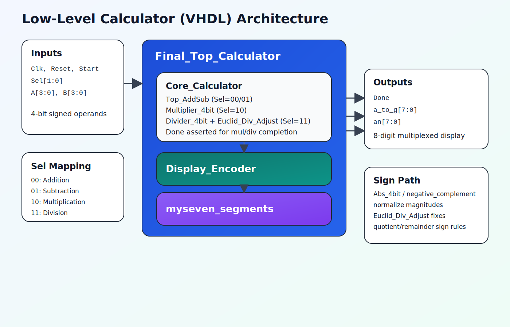

# Low-Level Calculator (VHDL)

A hardware calculator written in VHDL for 4-bit signed operands, with addition, subtraction, multiplication, and division, plus 8-digit seven-segment display output.

## Overview

This project implements a structural top-level design (`Final_Top_Calculator`) that combines:

- Arithmetic core (`Core_Calculator`)
- Result and sign formatting (`Display_Encoder`)
- 8-digit seven-segment scan/display driver (`myseven_segments`)

The calculator accepts signed 4-bit two's-complement inputs and operation select signals, then shows input/output information on the seven-segment display.

## Features

- 4 operations selected by `Sel[1:0]`
- Signed arithmetic for `A` and `B` (`-8` to `+7`)
- Sequential multiplier and divider with `Done` handshake
- Euclidean-style adjustment stage for division sign/remainder handling
- Vivado project included (`core_calculator.xpr`)

## Operation Select

| `Sel` | Operation |
|---|---|
| `00` | Addition |
| `01` | Subtraction |
| `10` | Multiplication |
| `11` | Division |

## Top-Level Interface

Entity: `Final_Top_Calculator`

Inputs:

- `Clk`
- `Reset`
- `Start`
- `Sel(1 downto 0)`
- `A(3 downto 0)`
- `B(3 downto 0)`

Outputs:

- `Done`
- `a_to_g(7 downto 0)`
- `an(7 downto 0)`

## Core Architecture

- `Core_Calculator` routes `Start` by selected operation:
- `Top_AddSub` for add/sub (combinational datapath with controller pulse behavior)
- `Multiplier_4bit` for multiply (iterative FSM)
- `Divider_4bit` for divide (iterative FSM)
- `Euclid_Div_Adjust` post-processes quotient/remainder sign logic
- `Display_Encoder` formats values into an intermediate packed display bus (`x_inter`)
- `myseven_segments` multiplexes and drives the physical display outputs

## Project Structure

- `core_calculator.xpr` - Vivado project file
- `core_calculator.srcs/sources_1/imports/FFFinal_Calculator/Final_Top.vhd` - top-level wrapper
- `core_calculator.srcs/sources_1/imports/FFFinal_Calculator/final_calculator.vhd` - arithmetic core integration
- `core_calculator.srcs/sources_1/imports/FFFinal_Calculator/Display_Encoder.vhd` - result/display encoding
- `core_calculator.srcs/sources_1/imports/FFFinal_Calculator/myseven_segments.vhd` - seven-segment scan driver
- `core_calculator.srcs/sources_1/imports/FFFinal_Calculator/Multiplier_4bit.vhd` - multiplier FSM
- `core_calculator.srcs/sources_1/imports/FFFinal_Calculator/Divider_4bit.vhd` - divider FSM
- `core_calculator.srcs/sources_1/imports/FFFinal_Calculator/euclidian.vhd` - Euclidean adjust stage
- `core_calculator.srcs/sim_1/imports/FFFinal_Calculator/Tb_Final_Top.vhd` - simulation testbench
- `core_calculator.srcs/constrs_1/imports/FFFinal_Calculator/main_display_xdc.xdc` - pin constraints

## Build and Run (Vivado)

1. Open Vivado.
2. Open project: `core_calculator.xpr`.
3. Confirm top module is `Final_Top_Calculator`.
4. Run synthesis/implementation and generate bitstream.

Target part in project file:

- `xc7a75tfgg484-1`

## Simulation

1. In Vivado, open Simulation Sources.
2. Use testbench `Tb_Final_Top_Calculator` (`Tb_Final_Top.vhd`).
3. Run behavioral simulation and inspect `Done`, `a_to_g`, and `an`.

## Notes

- `Done` is meaningful for multiplication and division completion.
- Inputs are treated as signed 4-bit two's-complement values.
- Division includes quotient/remainder correction logic via `Euclid_Div_Adjust`.
